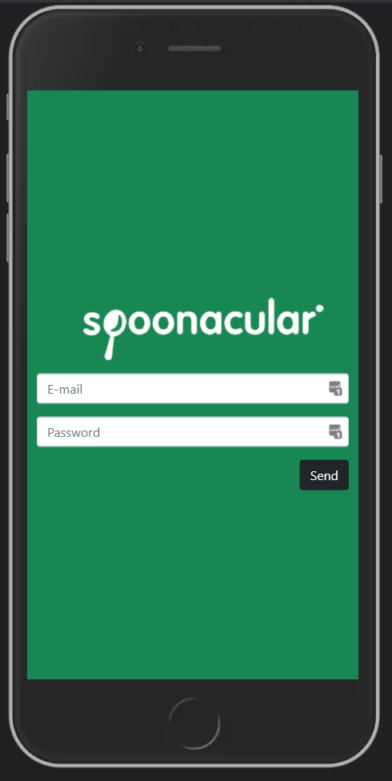
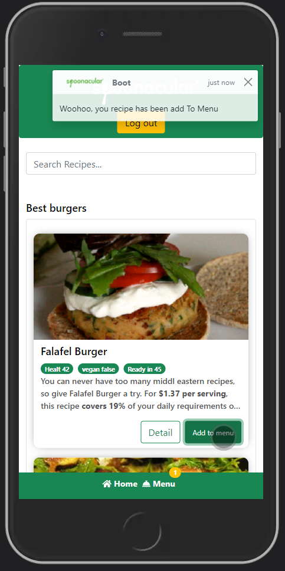
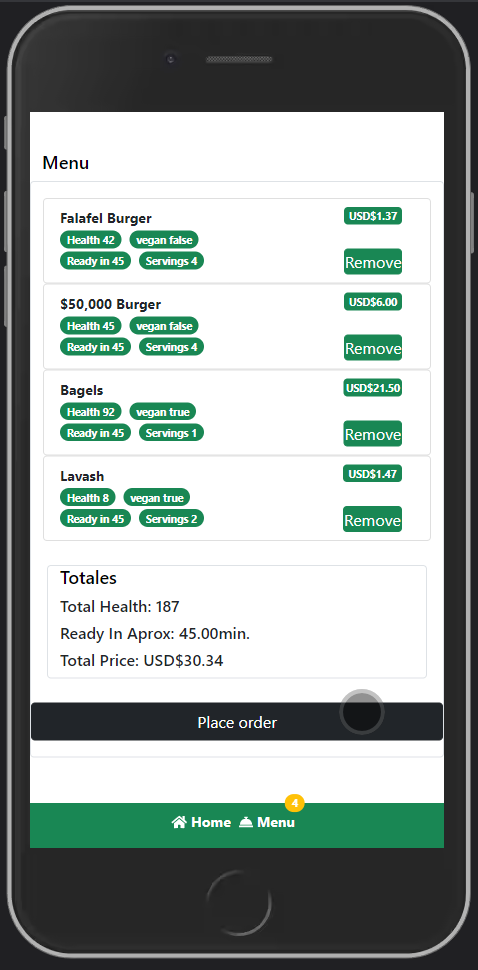
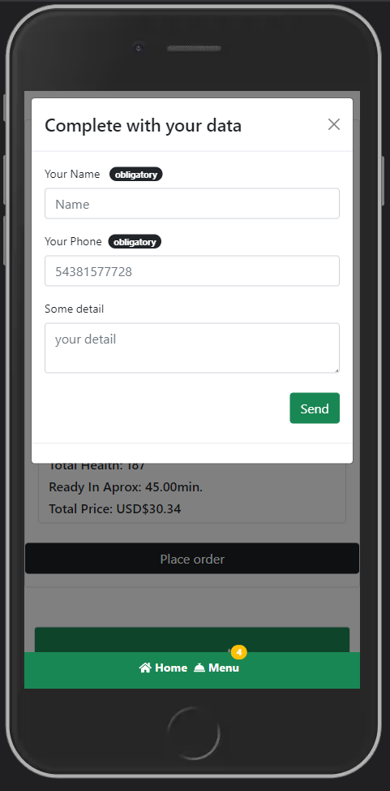
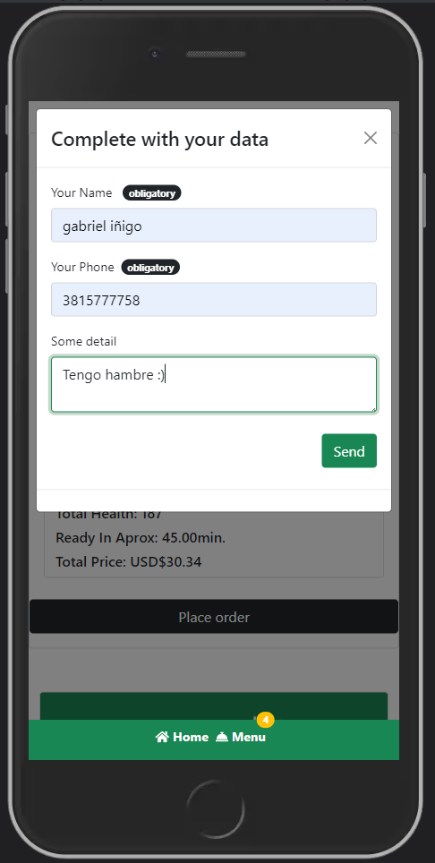
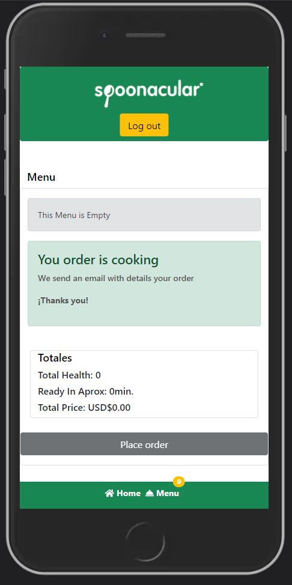
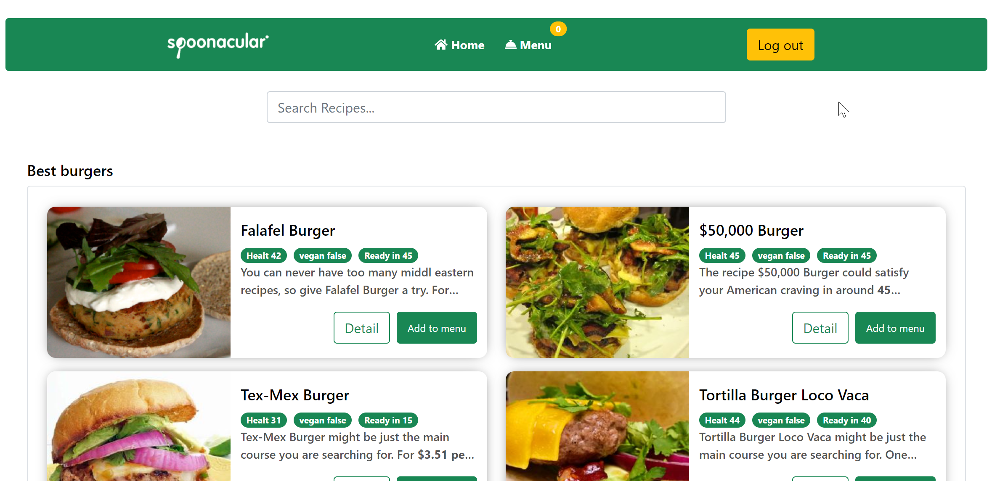

# Hotel Recipes | Spoonacular Api

## Caracteristicas de la App

- La App contiene 5.000+ recetas.
- Tiene un costo por cada request.
- Cuenta con un buscador.
- Validaciones en los formularios.
- Navegacion goBack pagina anterior.
- Cuenta con un menu para agregar las recetas.
- El menu debe tener como maximo 4 recetas, 2 veganas y 2 no veganas.
- Acumuladores para ver totales.
- Pagina de logueo.
- Controlador de rutas.


## ScreenShots 

<p align="center">
  

  
  
  
  
</p>

<p align="center">
  
</p>


## How to use

To clone and run this application, you'll need [Git](https://git-scm.com/downloads) and [React](https://es.reactjs.org/). From your command line:
```
# Clone this repository
$ git clone https://github.com/ginigo-arg/hotel-recipes.git

# Go into the repository
$ cd hotel-recipe

# Install dependencies
$ npm install

# Run the app
$ npm start
```

## Acceso
- User: challenge@alkemy.org
- Pass: react
